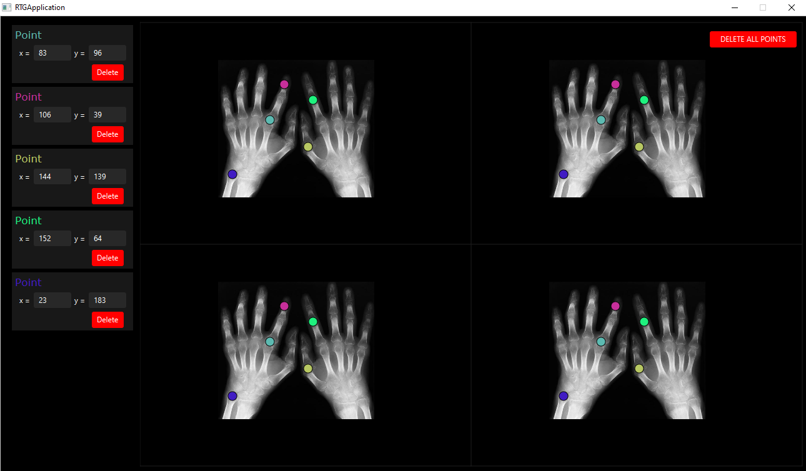

# RTGApplication

### Opcjonalna i dodatkowa funkcjonalność:
* Współrzędne punktów określane są względem obrazu.
* Walidacja pól tekstowych - w pola tekstowe można wpisać jedynie liczby, jeżeli wpisana liczba przekroczy wymiary obrazu zostanie ustawiona maksymalna możliwa wartość, jeżeli pole będzie puste zostanie ustawiona wartość 0.
* Walidacja punktów - punkty można przeciągać jedynie w granicach obrazu, nie jest też możliwe umieszczenie punktu poza obrazem.
* Usuwanie punktów - przy każdym punkcie na liście znajduje się przycisk umożliwiający usunięcie wybranego punktu z listy i jego graficznych reprezentacji z paneli, na panelu znajduje się również przycisk, który umożliwia usunięcie wszystkich punktów.

## Screen

  

